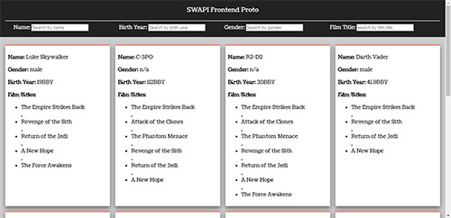

# SWAPI-frontend
A quick front-end prototype for the StarWars API from swapi.co

## Design Overview:
1. The frontend architecture was planned and built with network efficiency in mind, i.e., to keep number of calls made to server as minimum as possible.
2. Also the design is not intended for mobile screens that fall under the small screen category (support can be added with some extra media queries if needed).
3. To keep the POC prototype simple, the coding was done using raw jQuery and ES5 (ES6 Template literals were used). Use of any framework was intentionally avoided.
4. The code would use cached local data wherever possible (as mentioned in point 1).
5. Paginated calls will be made automatically on scroll-complete of the current rendered page.
6. Pagination will not be called when filters are applied. the filters have to be cleared with the clear filter button ('the red FAB button') to continue with pagination.
7. At any point the filter would consider only the data that has been already fetched. Future paginated data will be added to cache variable as and when a pagination response is received.
8. As an additional UX improvement, a scroll to top FAB would appear when the filters are scrolled beyond visibility.
9. All the filter inputs are intentionally made as type text.

10.Three Promises (to fetch people data, film title and merging appropriate film title with the corresponding person object) are used to avoid the callback-hell problem and the promises are implemented as jQuery Deferred objects.

## Workflow Screenshots:

  #### Initial Loader and UI block  
  
  
  #### Data Rendered as Cards
  
  
  #### Filter Actions 
  
  
  #### Pagination on Scroll
  

  #### FAB Actions
  
  
## File Structure:
- All the custom css styles are in the main.css file located inside the css folder.
- Js libraries namely jQuery and underscore are used in their minified form and can be found in ```js/lib```
- thw=e main js script is named as ```main.js`` and is in ```js`` directory.
- The template file is in the root directory and is named as ```index.html```.

## Steps to Run the Prototype:
To successfully run the prototype, an internet connection will be required on the testing machine.
opening the index.html file in the root directory will start the prototype.

## Intended Behaviour on Multiple Filter Value Scenario:
- The intended behaviour is an 'AND' behaviour.


